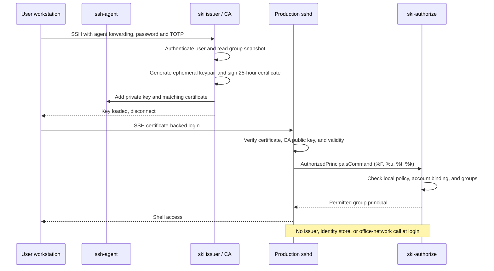

# ski

> [!NOTE]
> **What this project proves.** `ski` is a Python proof of concept for issuing
> short-lived SSH user certificates after password-and-TOTP authentication and
> loading the resulting identity into a user's existing `ssh-agent`. A target
> host can trust the issuer's public CA key and use a local, offline group
> policy to decide access; it never needs to contact the issuer during login.
> The bundled identity store is deliberately SQLite-backed and demonstration
> only. An adopting organization owns any production identity integration.

The project aims to replace the common model of every developer keeping a
long-lived, potentially weakly protected private key under `~/.ssh` and copying
its public half to every server. Instead, a user proves their identity to the
issuer, receives an agent-held credential with a bounded lifetime, and presents
it only to hosts which trust the CA and allow one of its signed group claims.

| Concern | Developer-managed `~/.ssh` key | `ski` short-lived certificate identity |
| --- | --- | --- |
| Private-key persistence | Often a long-lived private key on the laptop filesystem, potentially copied into backups or left with weak local protection. | A fresh private key is generated for issuance, held in memory, and injected into `ssh-agent`; it is not written beneath `~/.ssh`. |
| Credential lifetime | Commonly valid for years until every affected server is changed. | Valid for a configured period, 25 hours by default; renewal requires a new authenticated issuance. |
| Access distribution | Each target needs a user public key or another per-user access change. | Hosts trust the CA public key and enforce their own local allowed-group policy. |
| Deprovisioning | Requires finding and removing a key from all relevant targets. | Disabling a user or removing a group prevents new issuance. Existing certificates retain access only until expiry, unless a host receives an optional KRL. |
| Attribution | A key comment may identify an owner, but issuance context is usually absent. | Issuance records include certificate serial, canonical identity, signed principals, validity, and decision metadata. |
| Production-host availability | No issuer is needed, but key distribution is operationally expensive. | Hosts authorize locally and offline; the issuer is needed to issue or renew, not to accept a login. |

This changes the risk rather than eliminating it. The issuer and its CA private
key are sensitive, a compromised workstation or `ssh-agent` remains serious,
and forwarding an agent to an untrusted host is unsafe.



## Installation

Install [uv](https://docs.astral.sh/uv/) and Python 3.12 or later, then clone the
repository and install the project:

```console
uv sync
```

Run the command from the managed environment:

```console
uv run ski --help
```

## Configuration files

Before it starts, `ski` loads the first existing configuration file in this
order and stops searching:

1. `./.env`
2. `$HOME/.ski.env`
3. `/home/ski/etc/env`

Values already exported in the shell take precedence over values in that file.

## How to smoke test the implementation

Run these commands from the project root. First, start a dedicated, empty
agent in Terminal 1. Do not clear identities from an agent you normally use.

```console
eval "$(ssh-agent -s)"
ssh-add -l || true
```

In Terminal 2, start the local issuer on an unprivileged local port:

```console
mkdir -p /tmp/ski-smoke
# Configure a local persistent CA and database. Parent directories must exist.
export SKI_CA_DATABASE=/tmp/ski-smoke/state.sqlite3
export SKI_CA_PRIVATE_KEY=/tmp/ski-smoke/user_ca
export SKI_CA_PUBLIC_KEY=/tmp/ski-smoke/user_ca.pub
export SKI_CA_KRL=/tmp/ski-smoke/revoked.krl
export ORDINARY_CERT_EXTENSIONS=pty

uv run ski ca init
uv run ski ca show
uv run ski ca public-key
uv run ski user add test-user
# Save the displayed Base32 TOTP secret for the login below.
uv run ski serve --bind 127.0.0.1 --port 2222
```

It reports its bound address and remains in the foreground. Back in Terminal 1,
request an ordinary certificate with agent forwarding:

```console
ssh -A -tt -p 2222 \
  -o StrictHostKeyChecking=no \
  -o UserKnownHostsFile=/dev/null \
  test-user@127.0.0.1
```

Enter the enrollment password and the current six-digit TOTP generated from
the displayed secret. The issuer reports a line beginning with
`Key loaded: test-user serial=... valid-until=...`, followed by
`Groups: (none)`, and closes the session. Verify the local agent:

```console
ssh-add -l
```

The agent displays an `ED25519` key identity and an `ED25519-CERT` identity
with the same `ski:test-user:...` ownership marker. They are the private key
and its matching signed user certificate; together they are one usable
credential. The agent lifetime is bounded by the 25-hour certificate expiry.
It is accepted only by target hosts configured with this CA public key and a
permitting local policy; see [target-host installation](docs/TARGET-HOST.md).

To test that forwarding is required, repeat the SSH command with
`-o ForwardAgent=no`. It must report `Agent forwarding is required.` and add no
identity. Stop the server with Ctrl-C, then terminate the dedicated agent:

```console
eval "$(ssh-agent -k)"
```

The smoke-test directory contains the database, CA private/public files, and
empty KRL. Remove it when finished if desired:

```console
rm -f /tmp/ski-smoke/state.sqlite3 /tmp/ski-smoke/state.sqlite3.lock \
  /tmp/ski-smoke/user_ca /tmp/ski-smoke/user_ca.pub /tmp/ski-smoke/revoked.krl
rmdir /tmp/ski-smoke 2>/dev/null || true
```

## Intended operation

The demo CA is configured through the dotenv search path and initialized with
`ski ca init`. `ski ca show`, `ski ca public-key`, `ski ca log list`, and
`ski ca log verify` expose only public or redacted state. Ordinary certificates
contain the canonical user and normalized group principals and are valid for
exactly 25 hours. The separately installable `ski-authorize` helper supports
production-style OpenSSH hosts which trust the public CA and enforce a local,
offline group policy; see [target-host installation](docs/TARGET-HOST.md).

The issuer generates each user identity in memory and adds it through the
user's explicitly forwarded agent connection. It will not write that generated
private key to a file or return it in the session transcript.

Do not commit private keys, CA keys, issued certificates, or agent sockets.

## Development

The standard local checks are:

```console
uv run ruff format
uv run ruff check --fix
uv run ty check
uv run pytest
```
