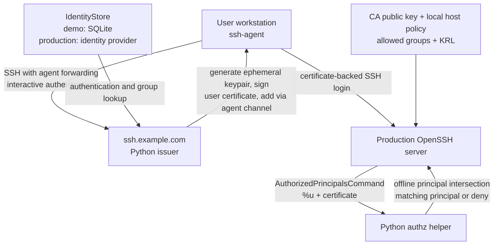

# SSH certificate architecture

## Purpose and scope

This project provides centrally issued, short-lived OpenSSH **user
certificates** for interactive access to production hosts. It does not replace
host-key verification or issue host certificates.

In this example, the issuing service is `ssh.example.com`. Each morning a user
connects to that service, completes the organisation's interactive
authentication, and receives a certificate valid for **25 hours**. The unusual
25-hour lifetime is intentional: it covers one workday plus the following
morning's renewal window. It must be an explicit, documented policy rather than
an accidental default.

The system is an access-control system. A successful SSH certificate check does
not by itself mean that a person may use a particular account on a particular
host. OpenSSH validates the certificate; a host-local authorization helper then
enforces the host's configured group policy at login time.

## Target architecture

The issuer creates an ephemeral keypair, signs an OpenSSH user certificate,
and adds the key and certificate to the user's existing agent through an SSH
agent-forwarding channel. It obtains user principals (including directory
groups) and supports separate regular, temporary, and emergency flows.

Production hosts trust the CA through `TrustedUserCAKeys` and run an
`AuthorizedPrincipalsCommand`. That command receives the target login user and
certificate, parses the certificate, and compares its signed group principals
with the host's local authorization policy. It does not contact the issuer or
an identity service during login.

AsyncSSH is suitable for the issuer-side SSH server and certificate/agent
protocol work. Production hosts may continue to use OpenSSH and a small,
privileged Python authorization executable; the OpenSSH interface is the
integration point, not the implementation language.

## Current implementation status

The running demo is an authenticated ordinary issuer: `ski serve` performs the
password-plus-TOTP exchange, signs with the configured persistent CA, and
injects the resulting ordinary credential into the forwarded agent. The
anonymous Epic 1 disposable credential path has been removed. The historical
dummy/tracer terminology retained in the delivery plan below describes prior
implementation boundaries, not a supported runtime mode.

## Deployment and Operational Model

`ski` runs as a foreground daemon. Its service command is:

```console
uv run ski serve [--bind IP] [--port PORT]
```

`--bind` defaults to `*`, which means that the daemon binds both `0.0.0.0` and
`::`. Startup fails if either required wildcard listener cannot be opened.
`--port` defaults to `22`. A specific address may be supplied with `--bind`.
The daemon owns these listening sockets. The deployment does not use systemd
socket activation or inherit listening file descriptors from a `.socket` unit.

The deployment target is a single active issuer instance supervised by
systemd. In development, `uv run ski serve` is the normal invocation. In a
production unit, deployment first creates the locked uv environment and
`ExecStart` invokes that environment's `ski serve` executable; it does not
resolve or install dependencies during service startup. The service runs under
a dedicated `ski` account whose home is `/home/ski`. Its application-local
state and configuration are `/home/ski/var/lib/ski` and `/home/ski/etc`, rather
than system-global `/var/lib` and `/etc` paths. Binding port 22 is supplied by
the operating system, for example through `CAP_NET_BIND_SERVICE`; `ski` itself
does not implement an additional administrator authorization model.

The source checkout, uv tool installation, environment file, CA material,
SQLite database, KRL, and service working directory are all below
`/home/ski` and owned by the installation account wherever possible. A
system-level systemd deployment necessarily has one root-owned unit file in
`/etc/systemd/system`; that file contains no secrets or mutable application
state.

The systemd unit uses `Type=simple`. systemd therefore considers the unit
started when the service process has been executed, before application startup
validation necessarily completes. After configuration, SQLite state, the
single-instance lock, and every requested listener are ready, `ski` emits a
structured application-level ready event. This event is operational evidence,
not an `sd_notify` readiness protocol. Startup failures exit nonzero and are
reported through the journal.

The daemon writes structured records through the native journald API using the
`systemd-python` binding. Application fields use stable journal names such as
`SKI_EVENT`, `SKI_REQUEST_ID`, `SKI_CERTIFICATE_SERIAL`, and
`SKI_DECISION`, alongside standard fields such as `MESSAGE`, `PRIORITY`, and
`SYSLOG_IDENTIFIER`. This makes application fields directly queryable instead
of embedding JSON inside the journal's `MESSAGE` field. `journalctl -u
ski.service` is the operator log interface. Certificate serials, canonical
identities, decisions, and request IDs may be logged; private keys, passwords,
TOTP secrets, agent payloads, and complete environment values must not be
logged. Logging is isolated behind an application interface so tests can use
an in-memory sink without requiring systemd or a running journal.

The systemd service owns process lifecycle:

| Event | Daemon behaviour |
| --- | --- |
| service start | Validate configuration, open SQLite, reconcile the KRL, bind application-owned listeners, then emit the structured ready event. |
| `SIGTERM` | Stop accepting new connections, allow bounded in-flight issuance work to finish or cancel it, then exit. |
| `SIGINT` | Apply the same graceful shutdown behaviour for development. |
| `SIGHUP` / `systemctl reload ski.service` | Validate and reload `.env`-derived configuration and file-backed/CA state. Retain the previous working configuration if reload fails. |

Every mutating CLI command first commits its SQLite transaction and atomically
replaces any file it owns, then notifies the running service with the systemd
reload mechanism when the service is active. This notification is a reload of
the daemon, not a second authorization channel. Read-only commands do not
reload the service. A command remains a durable success when the service is
stopped; the next service startup loads its committed state.

User/group changes are visible to subsequent issuer logins through SQLite
reads. Reloading provides a uniform operational rule and is necessary for
file-backed changes, especially CA activation and `.env` updates. SQLite uses
short transactions and one active writer; the issuer is not deployed
active-active or on network storage.

CA rotation follows deployment order: prepare a replacement CA key, distribute
both old and replacement public keys to hosts, activate the replacement key and
reload the issuer, wait at least the configured certificate lifetime, then
retire the old key. This ordering prevents issuance of certificates which
production hosts do not yet trust.

## CLI Surface

The command forms below omit the normal `uv run` prefix: for example, run
`uv run ski serve` or `uv run ski ca show`. The CLI resolves configuration using
the documented `.env` search order. It does not accept a per-invocation
configuration-file override: configuration selection is part of the deployment
contract. All commands support `--help`; `ski --version` prints the program
version.

### Service command

| Command     | Options                                                 |  Purpose                                                                               |
|-------------|---------------------------------------------------------|----------------------------------------------------------------------------------------|
| `ski serve` | `--bind IP` (default `*`); `--port PORT` (default `22`) | Run the foreground issuer SSH daemon. Systemd starts, reloads, and stops this command. |

### CA and KRL commands

| Command                                         | Options                                                                          |  Purpose                                                                                                                   |
|-------------------------------------------------|----------------------------------------------------------------------------------|----------------------------------------------------------------------------------------------------------------------------|
| `ski ca init`                                   | `--key-type TYPE` (default `ed25519`)                                            | Create the initial CA keypair, SQLite state, and empty KRL. Refuses to replace existing CA state.                          |
| `ski ca show`                                   | `--all`                                                                          | Display the active CA and, with `--all`, known/pending/retired CA records and KRL status. Never display private-key bytes. |
| `ski ca public-key`                             | `--fingerprint FINGERPRINT`                                                      | Print the selected CA public key for configuration-management distribution; default to the active CA.                      |
| `ski ca rotate prepare`                         | `--key-type TYPE` (default `ed25519`)                                            | Create and register a pending replacement CA. It does not begin signing certificates.                                      |
| `ski ca rotate activate FINGERPRINT`            | none                                                                             | Make a prepared CA the signing CA after its public key has been deployed to hosts.                                         |
| `ski ca rotate retire FINGERPRINT`              | none                                                                             | Retire a non-active CA only after its public-key overlap period has elapsed.                                               |
| `ski ca revoke --serial SERIAL --reason REASON` | `--ca FINGERPRINT` (default active CA)                                           | Record a revocation, materialize the KRL for currently unexpired certificates, and notify the daemon.                      |
| `ski ca reconcile`                              | none                                                                             | Rebuild the KRL from active revocations and run maintenance cleanup.                                                       |
| `ski ca log list`                               | `--serial SERIAL`, `--user USERNAME`, `--event KIND`, `--from TIME`, `--to TIME` | Query redacted CA-log and revocation-history records.                                                                      |
| `ski ca log verify`                             | none                                                                             | Check SQLite integrity, serials, CA state, and KRL materialization consistency.                                            |

### Demo identity commands

| Command                                                                          | Options | Purpose                                                             |
|----------------------------------------------------------------------------------|---------|---------------------------------------------------------------------|
| `ski user add USERNAME`                                                          | none    | Create a user; prompt for the initial password and TOTP enrollment. |
| `ski user show USERNAME`                                                         | none    | Display redacted account status and group memberships.              |
| `ski user list`                                                                  | none    | List users and enabled/disabled state.                              |
| `ski user enable USERNAME` / `ski user disable USERNAME`                         | none    | Change whether the issuer may issue a certificate for the user.     |
| `ski user password set USERNAME`                                                 | none    | Prompt for and replace the password verifier.                       |
| `ski user totp regenerate USERNAME`                                              | none    | Replace the TOTP secret and display enrollment data once.           |
| `ski group add GROUP` / `ski group remove GROUP`                                 | none    | Create or remove a group. Removal requires no memberships.          |
| `ski group show GROUP` / `ski group list`                                        | none    | Display a group's members or list groups.                           |
| `ski group member add GROUP USERNAME` / `ski group member remove GROUP USERNAME` | none    | Change group membership.                                            |

There is deliberately no application-level `ski stop` or `ski reload` command:
systemd owns daemon termination and reload. There is also no user deletion
command in the initial surface; disabling preserves identity and CA audit
history.

## Components and trust boundaries



### Issuer: `ssh.example.com`

The issuer is the signing service. It loads the SSH user-CA private key from
the file configured in its `.env` file when it starts, holds the parsed key in
process memory, and signs certificates locally. Its CA **public** key is
distributed to production hosts. This matches the operational model described
by this architecture; there is no separate signing API, HSM, or KMS component.

The issuer's SSH server identity is separate from the user CA. It uses one
persistent Ed25519 host key stored in the `ssh_host_keys` record of
`SKI_CA_DATABASE`, generated on first identity setup and loaded on every later
service start. The database file therefore protects this host private key as
well as the demo identity data. Distribution of the host public key or
`known_hosts` entry, database backup, and host-key rotation are external
operational responsibilities; `ski` has no host-key configuration setting,
automatic rotation, or host-key administration command.

The `.env` configuration records file locations, not private-key material. A
production `/home/ski/etc/env` may contain:

```dotenv
SKI_CA_PRIVATE_KEY=/home/ski/etc/keys/user_ca
SKI_CA_PUBLIC_KEY=/home/ski/etc/keys/user_ca.pub
SKI_CA_DATABASE=/home/ski/var/lib/ski/ca.sqlite3
SKI_CA_KRL=/home/ski/var/lib/ski/revoked.krl
SKI_CERTIFICATE_LIFETIME=25h
```

The private key and this production environment file are owned by the service
account (or root) and are not readable by ordinary users. The private-key file
is never committed, copied into an image, or logged. The public key may be
derived from the private key, but keeping a configured public-key path makes
CA distribution and rotation explicit. `SKI_CA_PRIVATE_KEY` identifies the
initial CA key path; prepared rotation keys are recorded with their own managed
paths in `ca_keys`, and activation selects the database record without editing
the environment file.

The issuer authenticates the requester, obtains a canonical identity and
current group membership through the `IdentityStore`, creates the certificate,
and records the issuance in the CA database.

The service is trusted to generate the short-lived private key in the reference
flow. The key must be generated with a cryptographically secure RNG, retained
only long enough to add it to the forwarded agent, and never logged, written to
a file, returned in a terminal transcript, or included in an API response. The
service is therefore part of the private-key exposure boundary. A later
client-generated-key protocol is outside this architecture: the issuer remains
responsible for generating the temporary key and injecting it through the
forwarded agent channel.

### Demo identity store

The demo stores users, password verifiers, TOTP secrets, and group memberships
in the same SQLite database configured by `SKI_CA_DATABASE`. The relevant
tables are `users`, `groups`, and `user_groups`. A user has a canonical user
name, a password hash, a TOTP secret, and an enabled/disabled status. Passwords
use `argon2-cffi`'s high-level Argon2id `PasswordHasher`, never cleartext. Its
parameters are benchmarked on issuer hardware and made application defaults;
on successful authentication the verifier is rehashed when it no longer meets
those defaults. TOTP uses `PyOTP`, with a secret of at least 160 bits generated
by Python's `secrets` module. Secrets and password verifiers are sensitive
database data: they are not logged or returned by normal user commands.

Canonical usernames match `^[a-z][a-z0-9_-]{0,31}$`; canonical group names
match `^[a-z][a-z0-9-]{0,62}$`. Inputs outside these already-lowercase ASCII
forms are rejected rather than case-folded. Groups are stored without a prefix;
a later certificate group principal is derived as `group:<group-name>`.

Issuer runtime access is isolated behind small structural protocols in
`ski.identities`, rather than requiring a production provider to implement demo
administration. The stable issuer-facing capability consists of:

- `CanonicalIdentityLookup.lookup_identity(username) -> str`: validate and
  return the canonical identity bound to the request. Implementations reject
  non-canonical input with a safe identity-store error and never return a
  display-name alias for signing; authentication and snapshot lookup reject
  unknown, disabled, or unavailable identities.
- `IdentityAuthenticator.verify_password(...) -> bool` and
  `verify_totp(...) -> bool`: verify the existing two factors. False and
  backend failures are handled as the same SSH authentication denial; factor
  values and backend details never escape to a client or log.
- `GroupSnapshotProvider.get_group_snapshot(...) -> IdentitySnapshot`: after
  both factors succeed, return the canonical identity and a current,
  normalized, immutable group tuple. Failure denies issuance before key or
  certificate work begins.

`IssuerIdentityProvider` combines these three read-only capabilities for the
SSH adapter. A production LDAP, Active Directory, or custom provider normally
implements only this combined contract and owns its own credentials, group
authority, transport, caching, and availability policy. It is not required to
implement `UserAdministration` or `GroupAdministration`; those optional
protocols are implemented only by the standalone `SqliteIdentityStore` demo
adapter for the local `ski user` and `ski group` mutation commands. Read-only
adapters must not expose password verifiers or TOTP secrets, and the issuer
must fail closed for malformed, ambiguous, or unavailable responses.

Production hosts do not receive a copy of the issuer's SQLite database and
never query `IdentityStore` at login. The certificate contains the signed group
membership snapshot obtained during issuance.

The administrative commands are local operator commands, separate from the
normal certificate-issuance login. They prompt for passwords and TOTP secrets
instead of accepting them as command-line arguments; see
[Demo identity commands](#demo-identity-commands) for their full surface.
Enrollment displays an `otpauth://` URI and its Base32 secret once, without
terminal QR rendering. TOTP verification uses 30-second steps and accepts the
previous, current, and next step (`valid_window=1`). Each SSH connection gets
at most one password/TOTP exchange. Network connection rate limiting is
external to `ski`; the demo does not implement source-address throttling or
persistent per-account lockout.

### User workstation and agent

The client experience is an interactive SSH login to the issuer with agent
forwarding:

```console
$ ssh ssh.example.com -A -l username
Password: <the password>
2FA: <TOTP>

Key loaded. Valid until 21-Aug-2026, 19:05 (25h).
Group memberships: <group list>
Run ssh-add -l to check.
Disconnected.
```

The issuer verifies the password and TOTP through `IdentityStore`, then uses
the forwarded agent protocol to add the private key and associated certificate
with a lifetime no longer than the certificate validity. It displays the
normalised group list used for the certificate, then closes the session. SSH
clients subsequently select that certificate when connecting to production
hosts. Agent forwarding is permitted only to the trusted issuer.

The client does not store the generated private key or certificate under
`$HOME/.ssh`; the identity lives in the running agent. At renewal, the client
removes or replaces identities it previously added, identified by an
unambiguous application comment and certificate serial/key ID. It must never
delete unrelated user agent identities.

### Certificate contents

Each certificate is an OpenSSH `user` certificate. The target model includes:

- a cryptographically random, unique serial number;
- a stable canonical user identity in `key_id`, not a display name;
- a validity interval of issue time through issue time plus the
  `SKI_CERTIFICATE_LIFETIME` duration, which defaults to 25 hours;
- a bounded set of `valid_principals`, including the canonical user and
  normalised group principals such as `group:platform-ops`;
- an explicit, minimal set of extensions (for example PTY only if needed);
- restrictive critical options when required, such as a source-address
  constraint for emergency access;
- issuer, authentication method, policy version, and request ID in the audit
  record. These belong in the audit system unless a compatibility-reviewed
  certificate field is appropriate.

Do not encode an arbitrary, unbounded attribute bag into principals or treat a
principal string as a free-form authorization language. Principal grammar,
case-folding, and group naming must be centrally specified and consistently
validated.

## CA lifecycle, database, and KRL

The CA keypair, serial allocation, certificate history, revocations, and CA-log
events are state owned by the issuer. They are administered locally through the
same Python command-line program, under a separately authorised operator
account. Issuance does not require an operator command; it uses the already
configured CA key.

`SKI_CA_DATABASE` is a SQLite database on the issuer's local filesystem. It is
the authoritative source of CA state and is suitable while a single active
issuer writes it. Do not place this database on network storage. A future
active-active deployment needs a transactional shared database instead.

The database contains at least these tables:

| Table                | Purpose                                                                                                                                                                                         |
|----------------------|-------------------------------------------------------------------------------------------------------------------------------------------------------------------------------------------------|
| `ssh_host_keys`      | The issuer SSH server's persistent Ed25519 private key, public key, and fingerprint. It is distinct from a user CA and has no application-managed rotation lifecycle.                          |
| `users`              | Demo canonical identity, Argon2id password verifier, TOTP secret, and enabled/disabled status.                                                                                                 |
| `groups`             | Demo canonical group names.                                                                                                                                                                     |
| `user_groups`        | Demo user/group memberships used for the issuer-side snapshot.                                                                                                                                |
| `ca_keys`            | CA public-key fingerprint, public key, configured private-key path, activation period, and key status for rotation.                                                                             |
| `certificates`       | One row per issued certificate: serial, CA fingerprint, user identity, public-key fingerprint, principals, validity interval, request ID, and issuance outcome. The serial is unique per CA.    |
| `revocation_events`  | The full append-only revocation history: CA fingerprint, certificate serial, time, operator identity, and reason. These records are retained for audit even after the certificate has expired.  |
| `active_revocations` | The current KRL materialization set: only revoked certificates whose `valid_before` is still in the future. It contains the CA fingerprint and certificate serial required to generate the KRL. |
| `events`             | Append-only issuance, rotation, revocation, and failed-operation records. Application code never updates or deletes rows from this table.                                                       |
| `krl_generations`    | KRL generation time, source-revocation state, CA fingerprint, output path, and file digest.                                                                                                     |
| `maintenance_state`  | The most recent successful active-revocation cleanup time and KRL reconciliation status.                                                                                                        |

The CA log is the `events` table together with the related certificate and full
`revocation_events` history. SQLite does not make it cryptographically
immutable: the issuer account and administrators must protect the database
file, and backups plus system logs provide the recovery and audit trail. It is
not a replacement for the system log.

The KRL is **not** a database table or source of truth. It is a binary file
derived from `active_revocations`, because production `sshd` instances consume
a KRL file rather than SQLite. The issuer always generates and atomically
replaces `SKI_CA_KRL`; configuration management may distribute the resulting
file to a host or may ignore it.

On revocation, the issuer writes both a `revocation_events` record and, if the
certificate is still unexpired, an `active_revocations` row. It then rebuilds
the KRL from every active row, atomically replaces `SKI_CA_KRL`, and records the
resulting digest in `krl_generations`. If KRL materialization fails, the
revocation history remains authoritative and the failed reconciliation is
recorded for retry and operator visibility.

On each issuer login, the service checks `maintenance_state`. If the previous
successful cleanup was more than one minute ago, it removes from
`active_revocations` every certificate with `valid_before < now`, rebuilds the
KRL only when that set changed, and records the cleanup time after the database
and KRL operations succeed. NTP synchronization is an operational prerequisite;
no additional clock-skew retention is used. This cleanup is opportunistic: a
startup or `ski ca` maintenance action also reconciles the KRL, while a missed
cleanup only leaves harmless expired entries in the materialized file.

The CA/KRL administration commands are defined in
[CA and KRL commands](#ca-and-krl-commands).

Each CA-log event includes event time, event type, issuer CA fingerprint,
certificate serial, public-key fingerprint, canonical identity, principals,
validity interval, request ID, and decision. Rotation and revocation events
include the applicable CA or certificate serial and an operator identity/reason.
It must exclude the CA private key, generated user private key, agent payloads,
authentication secrets, and full directory responses. The database and KRL
must be backed up and recoverable together with their integrity metadata.

## Issuance flow

1. The user connects to `ssh.example.com` with agent forwarding enabled and
   supplies their password and TOTP. The issuer verifies both factors through
   `IdentityStore` and binds the authenticated identity to the certificate; it
   never accepts a user name supplied only by the client.
2. The issuer queries `IdentityStore` for account status and group membership.
   It applies issuance policy: a disabled user, failed group lookup, or
   insufficient entitlement is a denial, not a partially populated certificate.
3. The issuer generates a fresh keypair and a random certificate serial. It
   signs a user certificate using the configured lifetime (25 hours by default)
   containing the canonical identity and validated principal claims.
4. The issuer opens the forwarded agent channel and adds the private key and
   certificate with an agent lifetime bounded by the certificate expiry. It
   removes prior identities that it owns, when safe to do so.
5. The issuer writes a structured CA-log event to the database containing the identity, serial,
   public-key fingerprint, requested/issued principals, validity, authentication
   context, and outcome. It must not log the private key or agent protocol
   payload.
6. The issuer closes the request session. The user can now SSH directly to
   production hosts using the agent-held identity.

Temporary and emergency issuance are distinct policy paths, not flags that a
normal requester can choose. They require stronger authorization, shorter
lifetimes where feasible, narrowly scoped principals and/or source-address
critical options, mandatory reason capture, prominent auditing, and a review
workflow.

## Production-host authentication and authorization

### OpenSSH configuration

Every production host receives the current CA **public** key and host-specific
policy configuration through the normal configuration-management system. It
must never receive the CA private key. A representative `sshd_config` is:

```sshconfig
PubkeyAuthentication yes
PasswordAuthentication no
KbdInteractiveAuthentication no
TrustedUserCAKeys /opt/ski-authorize/config/user-ca.pub
CASignatureAlgorithms ssh-ed25519
AuthorizedPrincipalsCommand /opt/ski-authorize/bin/ski-authorize --config /opt/ski-authorize/config/authorization.toml --ca-fingerprint %F %u %t %k
AuthorizedPrincipalsCommandUser ski-authz
# Optional early revocation: enable only if configuration management deploys it.
# RevokedKeys /opt/ski-authorize/config/revoked.krl
```

The exact `CASignatureAlgorithms` list must match the selected CA algorithm and
the OpenSSH versions in use. This project requires OpenSSH 9 or later on target
hosts. Epic 5 verifies the complete configuration on a current Rocky Linux 9.x
UTM guest; its documentation covers Debian and Ubuntu installation but does not
claim those distributions as tested in that epic. The helper executable and
`/opt/ski-authorize/config/authorization.toml` must be root-owned and
non-writable by ordinary users; the dedicated command user needs only the
ability to read the public configuration. It has no issuer credential or
issuer-network dependency.
Disable agent, TCP, X11, and port forwarding by default on production hosts and
allow them only in narrowly justified `Match` blocks.

The issuer always writes its local KRL. A production host may receive that file
through configuration management and enable `RevokedKeys`; if it does, the file
must be atomically replaced. A host which does not receive or configure the KRL
continues to rely solely on certificate expiry and local group policy. Neither
mode contacts the issuer during login.

OpenSSH first verifies that the presented object is a user certificate, that it
is time-valid, that it is signed by the configured CA public key, and that its
certificate semantics are valid. It then invokes `ski-authorize` with `%u` (the
requested local account), `%t` (the key/certificate type), `%k` (the
base64-encoded certificate), and `%F` (the offering certificate's CA
fingerprint). The helper reconstructs the public-key form from `%t` and `%k`
before parsing it, and requires `%F` to equal the local policy's explicit CA
fingerprint. The helper must return no principal and a non-zero exit status on
every error or denial. It returns only a principal which is actually present in
the certificate when access is allowed. This makes OpenSSH enforce the
intersection instead of treating either a certificate claim or server policy
alone as sufficient.

### Offline host group policy

Each host has an authorization policy at
`/opt/ski-authorize/config/authorization.toml`, deployed through configuration
management. The host package includes a small sample policy and matching
OpenSSH drop-in fragment; their final deployed files are root-owned and must be
reviewed for the site before activation.
The policy is local to that host, so its allowed groups are independent of
other production hosts. For example:

```toml
[ssh]
trusted_ca_fingerprint = "SHA256:..."
allowed_groups = ["group:platform-ops", "group:database-oncall"]
allow_self_login_only = true
```

`ski-authorize` performs the following checks in order:

1. Reconstruct `%t` plus `%k` as an SSH user certificate and require `%F` to
   equal the policy `trusted_ca_fingerprint`; reject malformed input, a
   non-user certificate, an unexpected CA/fingerprint, expired/not-yet-valid
   validity, missing `key_id`, or invalid principal grammar.
2. Bind the target account `%u` to the certificate identity. For normal access,
   require self-login (`%u == key_id`) or use an explicit, separately reviewed
   account-switch policy for service/root accounts.
3. Determine the set of group principals in the certificate and intersect it
   with the host's `allowed_groups`. Return one matching group principal only
   when that intersection is non-empty; otherwise exit non-zero without output.

This is deliberately an offline authorization decision. The signed group claim
is an integrity-protected snapshot and the host's local policy determines where
it is accepted. A group removal at the identity store does not affect fresh
logins made with an already issued certificate until that certificate expires,
up to the configured certificate lifetime (25 hours by default). Removing a
group from a host's local policy takes effect immediately on that host. Existing
SSH sessions are not retroactively terminated by certificate expiry, a group
removal, or a host policy change; session duration and termination controls are
a separate operational requirement.

## Security properties and trade-offs

Compared with user-owned long-lived `~/.ssh` keys, this architecture provides:

- **Bounded credential lifetime.** A lost or copied agent identity naturally
  expires after 25 hours rather than remaining valid until manually removed.
- **Central issuance control.** Disabled accounts, failed authentication, and
  invalid group membership prevent new certificates from being issued.
- **Offline production authorization.** A production host needs only its CA
  public key, KRL, local authorization policy, and helper; login does not cross
  a firewall boundary to the issuer or identity system.
- **Bounded deprovisioning delay.** A group-membership removal is recognised at
  the next certificate issuance, so an existing certificate may permit fresh
  logins for up to its configured lifetime (25 hours by default). A local
  policy removal takes effect at the next login, and an SSH KRL distributed to
  a host that opts in can revoke a specific certificate serial sooner for
  high-severity events.
- **Reduced filesystem persistence.** The issuer flow avoids private-key files
  under `$HOME/.ssh`; the agent lifetime limits retention. This does not protect
  a compromised workstation, compromised agent, or a user who forwards their
  agent to an untrusted host.
- **Scoped authorization.** A CA signature establishes issuer trust, while the
  server's own allowed-group configuration decides where the certificate can be
  used. No individual `authorized_keys` distribution is required.
- **Attribution and investigation.** Certificate serial, canonical identity,
  principal set, validity, request ID, and authorization decision form an
  auditable login trail.

Important residual risks require controls: the local CA private-key file and
issuer process are highly privileged; the issuer can inject a generated private
key into a forwarded agent; agent forwarding to an untrusted server permits
that server to request signatures; and a group-membership removal leaves an
already issued certificate usable for its configured lifetime unless a KRL is
distributed to and enabled by the particular host. The issuer and authorization
helper therefore fail closed, use least privilege, and require protected
secrets, time synchronization, rate limiting, and monitoring.

## Delivery Epics

Each section below bounds one future epic and may seed that epic's
`user-stories.md`. They are intentionally not user stories or implementation
tickets. The first sections are retained as historical delivery boundaries;
the current implementation status above is authoritative for runtime behavior.

### Epic 1 — Historical dummy issuer and agent-injection tracer

**Historical goal.** Run a test-only AsyncSSH issuer which accepts a forwarded
agent, generates an ephemeral keypair, signs a dummy user certificate, and
injects it into that agent.

**Includes.** The `ski serve` command shape, a non-production test listener,
agent-forwarding protocol handling, a disposable test CA, short-lived dummy
certificates, and end-to-end tests with a real local `ssh-agent`.

**Historical exit boundary.** A test user can see the injected identity with
`ssh-add -l`.
The certificate is deliberately useless: no production host trusts its CA, and
there is no persistent CA, SQLite state, password/TOTP authentication, group
claim, KRL, or production-host helper yet.

### Epic 2 — Daemon runtime and local service state

**Goal.** Make `ski serve` a durable, single-instance service according to the
[Deployment and operational model](#deployment-and-operational-model).

**Includes.** `.env` loading, bind/port semantics including wildcard IPv4 and
IPv6 binding, SQLite opening and short transaction discipline, structured
journald logging, `SIGTERM`/`SIGINT` shutdown, `SIGHUP` reload, systemd unit
behaviour, and mutation-command notification of an active service.

**Historical exit boundary.** The service can be stopped, started, and reloaded without
database corruption or accepting connections against a partially loaded
configuration. This epic does not add real user authentication or make the
dummy certificates usable on production hosts.

### Epic 3 — Demo identities and interactive issuer login

**Historical goal.** Replace the dummy requester with the demo SQLite-backed password,
TOTP, user, and group model described in
[Demo identity store](#demo-identity-store).

**Includes.** The `IdentityStore` abstraction and `SqliteIdentityStore`, secure
password verification, TOTP verification/enrollment, enabled/disabled users,
group membership snapshots, and every `ski user`/`ski group` command listed in
[Demo identity commands](#demo-identity-commands).

**Exit boundary.** `ssh ssh.example.com -A -l username` performs the documented
password-plus-TOTP exchange and reports the authenticated user's groups. A
production identity-provider adapter, service-account switching, and
emergency/temporary access remain out of scope.

### Epic 4 — Persistent CA and ordinary certificate issuance

**Goal.** The current demo runs an ordinary certificate issuer backed by the
configured CA files and SQLite state.

**Includes.** Initial CA creation, CA-key loading, certificate serial
allocation, certificate/CA-log persistence, configured certificate lifetime,
normalised signed group principals, application-owned agent cleanup, and the
ordinary issuance subset of [CA and KRL commands](#ca-and-krl-commands).

**Exit boundary.** A successfully authenticated demo user receives a
25-hour-by-default certificate bound to a persisted CA and has it injected into
the agent. This epic does not yet make any production host accept the
certificate or implement early revocation/KRL materialization.

### Epic 5 — Offline production-host authorization

**Goal.** Make a production-style OpenSSH test host accept the CA-issued
certificate only when its local policy permits it.

**Includes.** Distribution of a CA public key, the documented `sshd_config`,
`/opt/ski-authorize/config/authorization.toml`, the offline `ski-authorize`
helper, account binding, principal grammar validation, and intersection of
signed group claims with local `allowed_groups`.

**Exit boundary.** Helper/unit tests and a manual smoke test on a current Rocky
Linux 9.x UTM host prove that a host neither contacts nor needs the issuer or
identity store at login. They cover accepts and denials for signature, expiry,
account binding, malformed certificates, missing group claims, and disallowed
groups. KRL use, external identity providers, and privileged account switching
remain out of scope. The next security review follows Epic 6 rather than Epic
5.

### Epic 6 — Revocation, KRL, and CA rotation

**Goal.** Implement early-revocation materialization and safe CA key lifecycle
without making host login depend on the issuer.

**Includes.** `revocation_events`, `active_revocations`, KRL generation and
atomic replacement, one-minute opportunistic cleanup, KRL reconciliation,
optional `RevokedKeys` host adoption, and the prepare/activate/retire CA
rotation flow from [CLI surface](#cli-surface).

**Exit boundary.** The issuer always writes a current local KRL. A test host
which receives and enables it rejects an unexpired revoked certificate; a host
without it retains the configured certificate-lifetime behaviour. Rotation
follows public-key deployment overlap. This epic does not require configuration
management to distribute the KRL.

### Epic 7 — Production identity and controlled access variants

**Goal.** Replace demo identity lookup without changing the issuance or
offline-host authorization contracts, then introduce explicitly scoped access
variants.

**Includes.** A production `IdentityStore` adapter, identity/group lookup
failure semantics, ordinary account mapping, and separately designed temporary,
emergency, service-account, or root access paths.

**Exit boundary.** The production adapter is issuer-side only. Every
non-ordinary access variant has its own eligibility, principal scope, validity,
critical options, audit requirements, and test coverage. It must not broaden
ordinary certificate access by default.

### Epic 8 — Operational assurance and security regression suite

**Goal.** Make the service supportable and preserve the access-control
invariants established by the earlier epics.

**Includes.** Backup/restore drills for CA files, SQLite, and KRL; CA-log and
KRL verification; journald field conventions; metrics/alerts; NTP health;
incident and break-glass procedures; real OpenSSH and agent integration tests;
negative and malformed-input tests; and regression coverage for fail-closed
behaviour.

**Exit boundary.** The project has documented operational recovery and evidence
that invalid input, unavailable local state, incorrect policy, expired
certificates, and optional-KRL absence do not accidentally grant access.
